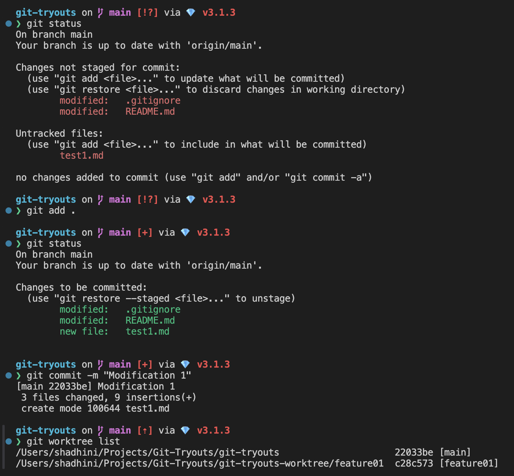

# Git Worktree

For a more concise explanation of Git Worktrees, check out my Medium blog.



## Git Worktree

> **checkout multiple branches or commits simultaneously in separate directories**

* Worktrees allow you to have multiple working directories for a single repository, each checked out to different branches or commits.
* To switch between branches, simply change the directory to the corresponding folder.

<figure><figcaption><p>Git Worktree Example</p></figcaption></figure>

In the above setup, the main branch is linked to a directory named "main," which is located one logical level above (../) the repository folder.

## Usage Example

```bash
shadhi@MacBook:~/Projects/Git-Tryouts/git-tryouts% git status
On branch main
Your branch is up to date with 'origin/main'.

Changes not staged for commit:
  (use "git add <file>..." to update what will be committed)
  (use "git restore <file>..." to discard changes in working directory)
        modified:   .gitignore
        modified:   README.md

Untracked files:
  (use "git add <file>..." to include in what will be committed)
        test1.md

no changes added to commit (use "git add" and/or "git commit -a")
```

* Note that, the "git-tryouts" repository has been cloned, and there are some local changes that haven't been staged yet.&#x20;
  * Changes:
    * updated  `README.md` , `.gitignore`
    * new file `test1.md`

***

### **View list of all the worktrees associated with the git repository**

> **git worktree list**

```bash
shadhi@MacBook:~/Projects/Git-Tryouts/git-tryouts% git worktree list
/Users/shadhini/Projects/Git-Tryouts/git-tryouts  c28c573 [main]
```

* The current Git worktree has only one directory, `git-tryouts`, where the `main` branch is checked out at commit `#c28c573`.

***

### Attempt to create a new worktree for a branch that is already checked out in the directory

* Here's an attempt to create a new worktree in the `../git-tryouts-worktree/main` directory for the currently checked-out `main` branch. However, the attempt fails because the `main` branch is already checked out in the current directory.


```bash
shadhi@MacBook:~/Projects/Git-Tryouts/git-tryouts% git worktree add ../git-tryouts-worktree/main
Preparing worktree (checking out 'main')
fatal: 'main' is already checked out at '/Users/shadhini/Projects/Git-Tryouts/git-tryouts'
```



If the trailing part of the directory path contained a different name other than `main`, then a new branch will be created with that name in the specified directory.



A new worktree cannot be created for an already checked-out branch in any worktree.


***

### Add a worktree for a new branch

> **git worktree add \<PATH\_TO\_NEW\_WORKTREE/NEW\_BRANCH\_NAME>**

* Check out the current repository's latest commit to a new branch called `feature01`, and add a worktree for it in the `../git-tryouts-worktree/feature01` directory.

```bash
shadhi@MacBook:~/Projects/Git-Tryouts/git-tryouts% git worktree add ../git-tryouts-worktree/feature01
Preparing worktree (new branch 'feature01')
HEAD is now at c28c573 Initial commit

shadhi@MacBook:~/Projects/Git-Tryouts/git-tryouts% git worktree list
/Users/shadhini/Projects/Git-Tryouts/git-tryouts                     c28c573 [main]
/Users/shadhini/Projects/Git-Tryouts/git-tryouts-worktree/feature01  c28c573 [feature01]

shadhi@MacBook:~/Projects/Git-Tryouts/git-tryouts% cd ../git-tryouts-worktree/feature01 

shadhi@MacBook:~/Projects/Git-Tryouts/git-tryouts-worktree/feature01% git status
On branch feature01
nothing to commit, working tree clean

shadhi@MacBook:~/Projects/Git-Tryouts/git-tryouts-worktree/feature01% git worktree list
/Users/shadhini/Projects/Git-Tryouts/git-tryouts                     c28c573 [main]
/Users/shadhini/Projects/Git-Tryouts/git-tryouts-worktree/feature01  c28c573 [feature01]
```

* Available branches now...

```bash
shadhi@MacBook:~/Projects/Git-Tryouts/git-tryouts% git branch -a
+ feature01
* main
  remotes/origin/HEAD → origin/main 
  remotes/origin/main
```

***

### Push changes to the remote with new branches

* Commit local changes to `main` branch and push all updates to remote repository.&#x20;

<figure><figcaption></figcaption></figure>

<figure><figcaption></figcaption></figure>

* The newly created `feature01` branch through the `git worktree add` command is also pushed to the remote repository using the `git push --all origin` command.

***

* Create 2 new worktrees:  `feature02` at `../git-tryouts-worktree/feature02` and `docs-test` at the `./docs-test` directory, and push them both to the remote repository.

<figure><figcaption></figcaption></figure>

<figure><figcaption></figcaption></figure>

***

### Remove git worktree

> **git worktree remove \<PATH>**

* Remove git worktrees: `./docs-test` and `../git-tryouts-worktree/feature02.`

<figure><figcaption></figcaption></figure>

<figure><figcaption></figcaption></figure>

<figure><figcaption></figcaption></figure>


* Adding a worktree results in creating the corresponding branch locally, and you can push it to the remote repository if needed.&#x20;
* Removing a worktree does not delete the corresponding remote/local branch; only the local worktree directory gets deleted.&#x20;


***

### Add a new worktree for existing branch&#x20;

> **git worktree add \<PATH\_TO\_NEW\_WORKTREE> \<BRANCH\_NAME>**

<figure><figcaption></figcaption></figure>

***

### Check out a specific commit (by hash) into a new worktree

> **git worktree add \<PATH\_TO\_NEW\_WORKTREE> \<COMMIT>**

* Currently the `main` branch has following commits.&#x20;

<figure><figcaption></figcaption></figure>

* Check out commit `#b5f89a24673a80a387852d49959d774ebfcce31a` into a new worktree at `../git-tryouts-worktree/feature03`.

<figure><figcaption></figcaption></figure>

<figure><figcaption></figcaption></figure>

<figure><figcaption></figcaption></figure>

* This results in adding a new worktree and checking out the specified commit in a **detached HEAD** state there.

***

### Commit changes from a worktree with a detached HEAD to a new branch

* This can be done by committing the local changes of the worktree with the detached HEAD and then checking out a new branch using the `git checkout -b <NEW_BRANCH>` command.
* This branch can then be pushed to the remote repository if needed.

<figure><figcaption></figcaption></figure>

<figure><figcaption></figcaption></figure>

<figure><figcaption></figcaption></figure>

***


## Command Guide

<table><thead><tr><th width="296">Command</th><th>Description</th></tr></thead><tbody><tr><td><pre class="language-bash"><code class="lang-bash">git worktree list
</code></pre></td><td><p>Display a list of all the worktrees associated with the Git repository.<br>Output format:</p><pre class="language-bash"><code class="lang-bash">&#x3C;PATH_TO_WORKTREE> &#x3C;COMMIT_HASH_OF_THE_CURRENT_HEAD> [&#x3C;BRANCH_CURRENTLY_CHECKED_OUT>]
</code></pre></td></tr><tr><td><pre class="language-bash"><code class="lang-bash">git worktree add &#x3C;PATH> [&#x3C;BRANCH>]
</code></pre></td><td><p>Create a new worktree at the specified path with existing branch checked out.</p><pre class="language-bash"><code class="lang-bash">git worktree add &#x3C;PATH_TO_NEW_WORKTREE> &#x3C;BRANCH_NAME>
</code></pre><p>Add a worktree for a new branch. If new-branch-name doesn’t exist,  it will be created and checked out in the new worktree.</p><pre class="language-bash"><code class="lang-bash">git worktree add &#x3C;PATH_TO_NEW_WORKTREE/NEW_BRANCH_NAME>
</code></pre><p>Check out a specific commit (by hash) into the new worktree, resulting in a detached HEAD state.</p><pre class="language-bash"><code class="lang-bash">git worktree add &#x3C;PATH_TO_NEW_WORKTREE> &#x3C;COMMIT>
</code></pre></td></tr><tr><td><pre class="language-bash"><code class="lang-bash">git worktree remove &#x3C;PATH>
</code></pre></td><td>Remove a worktree that was previously added<br>This will remove the immediate folder where the worktree resides, but any additional directories created along the path, other than the immediate folder, won't be deleted.<br></td></tr></tbody></table>


It's always best practice to clean up a worktree after finishing your work there. If you check out a branch that's already checked out through a worktree, you might get some weird errors. It's best to take care of (remove) your worktrees as soon as you don't need them anymore.


## Best Practices


1. **Keep Worktrees Organized**:
   * Name your worktrees meaningfully.
   * Use a consistent directory structure to store your worktrees.
     * e.g: dedicated folder named `worktrees` in main repository directory
2. **Clean Up Unused Worktrees**:
   * Regularly check for and remove worktrees that are no longer needed.
   * Always remove a worktree using `git worktree remove` instead of manually deleting the directory, to ensure  Git metadata is correctly updated.
3. **Avoid Conflicting Changes**:
   * Be cautious when working on branches that are closely related or have dependencies between them in different worktrees.
   * Avoid switching to the same branch in multiple worktrees.
4. **Use Worktrees for Context-Switching**:
   * context-switching between features, bug fixes, or code reviews.&#x20;
5. **Beware of Detached HEAD States**:
   * Make sure to create a new branch if you want to commit changes in this state.
6. **Monitor Disk Space and clean up as necessary**:
   * Worktrees share the same `.git` directory but maintain separate working directories, which can consume significant disk space when used extensively.&#x20;
7. **Leverage Automation**:
   * Automate the creation and management of worktrees with scripts or aliases if you frequently use worktrees for specific workflows, like code reviews or feature development.
8. **Stay Aware of Shared Git Data**:
   * All worktrees share the same repository data, including branches, tags, and history.&#x20;
   * Actions in one worktree (like deleting a branch) can impact others.
9. **Avoid Unnecessary `git fetch` or `git pull`**:
   * Since all worktrees share the same `.git` directory, fetching or pulling updates in one worktree updates the shared data.
10. **Understand Index Locking**:
    * Each worktree has its own index file, so operations that modify the index (like `git add`) won't conflict across worktrees.&#x20;
    * However, be mindful of repository-wide operations like `git gc` that can still affect all worktrees.

## Summary

> Git worktrees are simply directories where you can check out a branch and start working, allowing you to have multiple working copies of your repository at the same time.&#x20;
>
> This enables:
>
> * ✅ Development of multiple features concurrently&#x20;
> * ✅ Testing changes in isolation&#x20;
> * ✅ Working on long-lived feature branches&#x20;
> * ✅ Reduction of the risk of merge conflicts

<figure><figcaption></figcaption></figure>

